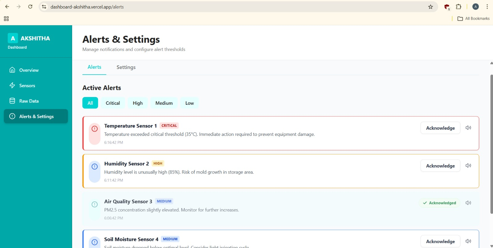
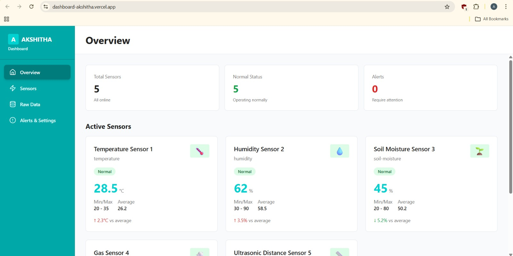
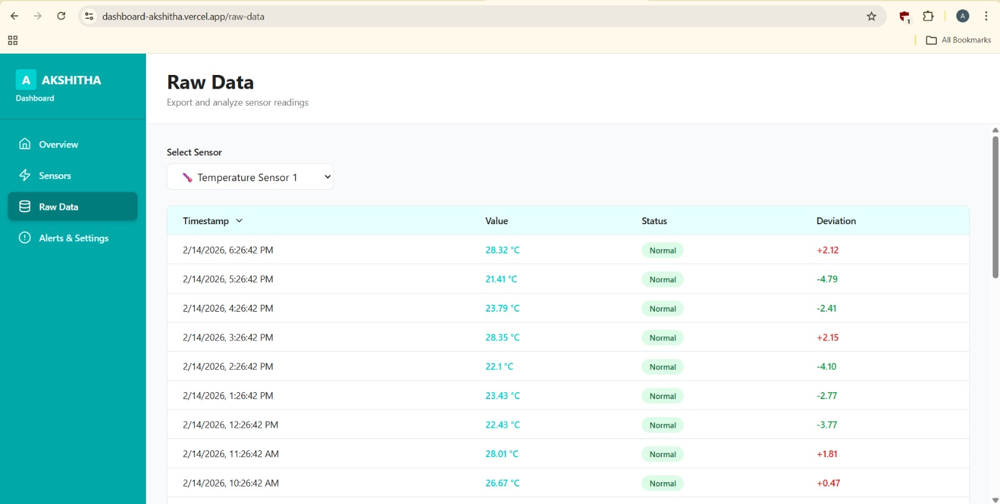
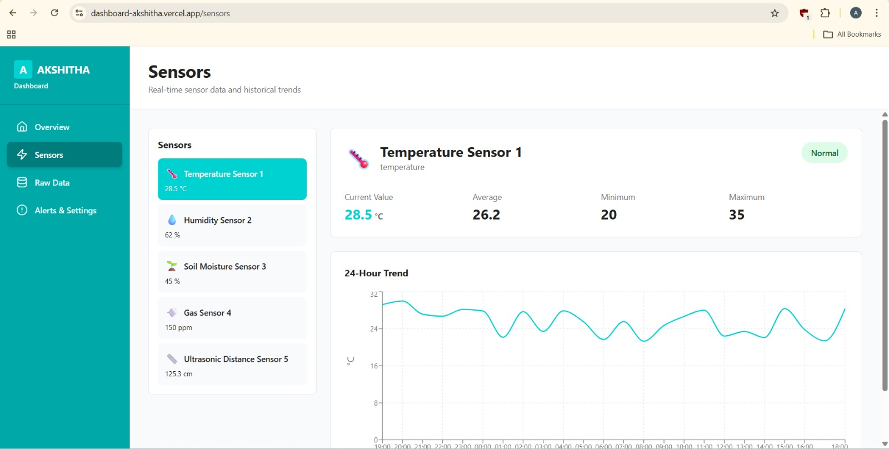

<!--
Generative AI Dashboard
-->
# 🚀 Generative AI Dashboard

[](https://vercel.com)
[](#)
[](#)
[](LICENSE)

A professional, beginner-friendly full-stack dashboard showcasing real-time sensor data, AI-driven insights, and a responsive UI — built with Visily, VS Code, and deployed on Vercel.

---

## ✨ Project Overview

This repository contains a Generative AI Dashboard — a full-stack project that visualizes sensor data in real time, surfaces AI-generated insights, and provides a clean, responsive UI suitable for demos and portfolios.

- UI designed with **Visily** ✨
- Frontend + Backend scaffolded using **VS Code** 🚀
- Deployed on **Vercel** ☁️
- Demonstrates core Generative AI concepts (LLMs, embeddings, prompts)

---

## Features ✅

- Real-time sensor data visualization
- AI-driven insights & anomaly explanations
- Responsive, modern UI (mobile-first)
- Alerts and acknowledgement flows
- Simple JSON-backed data store for quick demoing
- Clean separation of frontend (Next.js) and backend (Node + TypeScript)

---

## 🧰 Tech Stack

- Frontend: Next.js (TypeScript), Antigravity components
- Backend: Node.js + TypeScript (API routes / controllers)
- Styling: Tailwind CSS
- UI Design: Visily (design -> implementation handoff)
- Deployment: Vercel
- Data: Local JSON store (for demo) with sample thresholds and alerts

---

## 🤖 AI Tools & Concepts Used

- Generative AI concepts: prompting, contextual responses, summarization
- Large Language Models (LLMs) — e.g., OpenAI-style APIs or local LLMs for insights
- Embeddings & semantic search (for contextualizing sensor data)
- Prompt engineering for actionable explanations and alert summaries

> Note: This repo demonstrates concepts and integration points — you can plug in your preferred AI provider (OpenAI, Anthropic, Llama, etc.).

---

## 🏛 Architecture Overview

- `sensor-dashboard-frontend/` — Next.js app (UI, charts, pages, API routes for UI-only functions)
- `sensor-dashboard-backend/` — Node + TypeScript backend (controllers, routes, data store)
- `data/` — sample JSON data (thresholds, mock sensor values)
- AI layer (conceptual) — an integration point where sensor data is summarized and analyzed by an LLM to create insights and human-readable explanations

Flow:
- Sensors -> Backend ingest/store -> Frontend subscribes (or polls) -> Visualize & trigger alerts -> AI analyzes alerts to generate insights

---

## ⚙️ Installation & Setup (Beginner-friendly)

Prerequisites:

- Node.js (LTS) installed: https://nodejs.org/
- Git installed: https://git-scm.com/
- (Optional) pnpm for frontend: `npm install -g pnpm`

Clone the repo:

```bash
git clone https://github.com/your-username/your-repo.git
cd your-repo
```

Install dependencies for each workspace:

Backend:

```bash
cd sensor-dashboard-backend
npm install
# or: pnpm install
```

Frontend:

```bash
cd ../sensor-dashboard-frontend
pnpm install # recommended if you have pnpm
# or: npm install
```

If you plan to use an AI provider, add your API keys as environment variables (see `Environment` below).

---

## ▶️ How to Run Locally

Start the backend (example):

```bash
cd sensor-dashboard-backend
npm run dev
```

Start the frontend (example):

```bash
cd sensor-dashboard-frontend
pnpm dev
# or: npm run dev
```

Open `http://localhost:3000` (or the port shown in the terminal) to view the dashboard.

Environment variables (example):

```
AI_API_KEY=your_api_key_here
NODE_ENV=development

# Place in .env.local for Next.js or a .env file for backend as needed
```

---

## 🚀 Deployment (Vercel)

This project is deployed on Vercel. Quick steps to deploy:

1. Push your repository to GitHub.
2. Sign in to Vercel and import the repo.
3. Configure project settings: ensure `sensor-dashboard-frontend` is detected as a Next.js app.
4. Add environment variables (e.g., `AI_API_KEY`) in the Vercel dashboard.
5. Deploy — Vercel will build and publish the frontend. If you want the backend server to run as serverless functions, configure the API routes or deploy the backend as a standalone service.

Tip: Vercel can auto-deploy from `main` on every push for a polished portfolio experience.

---

## 🔮 Future Improvements

- Add persistence via a managed database (Postgres, MongoDB)
- Real websocket / SSE support for true real-time updates
- Role-based access control and authentication
- Richer AI features: embeddings-based search, alert root-cause analysis
- E2E tests and CI pipeline
- Add visual screenshots and demo GIFs to the README

---

## 🖼️ Screenshots (Placeholders)

Replace these placeholders with actual images from `sensor-dashboard-frontend/public`.






---

## 🤝 Contribution

Contributions are welcome! To contribute:

1. Fork the repository
2. Create a feature branch: `git checkout -b feat/my-feature`
3. Commit your changes: `git commit -m "feat: add ..."`
4. Push and open a pull request

Please open issues for bugs or feature requests.

---

## 📄 License

This project is provided under the **MIT License**. See the `LICENSE` file for details.

---

If you want, I can also:

- Add actual screenshots to the `public/` folder and update the README
- Add a short demo GIF and link to a live Vercel deployment

Happy to make those next — tell me which screenshot images you'd like added!
# dashboard
